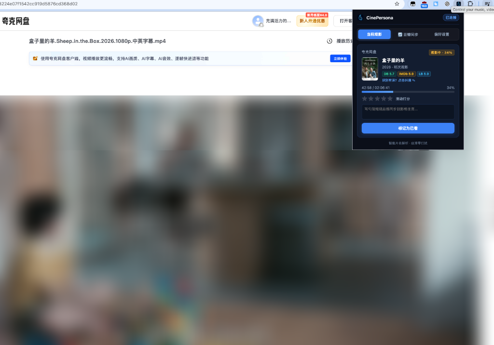
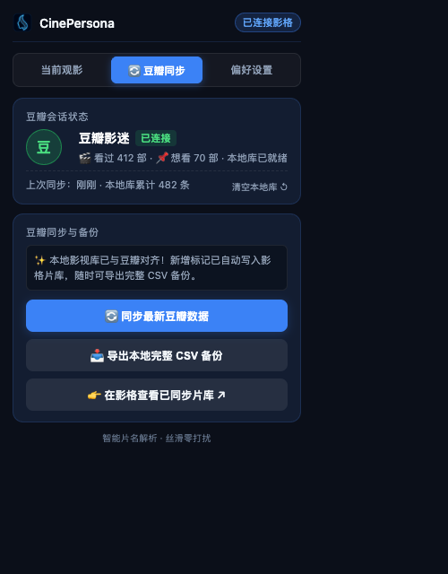
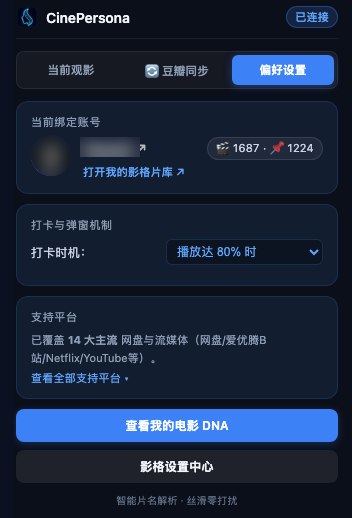

# CinePersona 影格助手 (Browser Extension)

<p align="center">
  
</p>

<p align="center">
  <b>网页与网盘观影全自动打卡 · 豆瓣历史智能同步与离线备份 · 电影性格 DNA</b>
</p>

<p align="center">
  
  
  
  
  
</p>

---

## 📸 核心界面预览 (Showcase)

### 1. 网页与网盘观影智能识别与实时打卡 (Now Playing)
> 在夸克网盘播放带有复杂压制参数与中英标签的视频文件（如 `盒子里的羊.Sheep.in.the.Box.2026.1080p.中英字幕.mp4`），插件自动剥离噪点、提取纯正片名、匹配权威数据库与海报，并实时追踪播放进度（34%），随手滑动半星打分、写短评一键同步。

<p align="center">
  
</p>

### 2. 豆瓣历史智能同步与本地全量 CSV 备份 (Douban Sync)
> 免输入密码与 Cookie，原生读取浏览器会话。本地自动维护全量离线数据库，增量对齐极速抓取新标记；随时一键导出包含全部评分、短评与日期的标准 CSV 备份，再也不怕账号异常或数据丢失。

<p align="center">
  
  &nbsp;&nbsp;&nbsp;&nbsp;
  
</p>

---

## ✨ 核心亮点功能

### 🎬 1. 全自动网页与网盘观影打卡 (Scrobbler)
* **智能片名降噪清洗**：自动剔除点分式压制标签（`1080p`、`2160p`、`BluRay`、`WEBRip`、`x264`、`中英字幕` 等），从混杂的文件名中提取纯净中文名/原名与上映年份。
* **剧集与短视频智能隔离**：通过视频时长（支持 >40 分钟电影特征比对）、分类标签与 DOM 布局深度分析，严格屏蔽电视剧单集、综艺短片与花絮，防止脏数据污染你的影格电影足迹。
* **实时播放进度监听**：支持跨 iframe、Shadow DOM 播放器监听，达到预设阈值（默认 80%）自动记录已看，支持滑动评半星（0.5~5 星）与快速填写观后感。
* **多源权威评分聚合**：浮窗内同屏聚合 **豆瓣评分 · IMDb 评分 · Letterboxd 评分 · 影格社区评分**，告别在多个标签页之间反复来回搜索。
* **片名手工纠偏搜索**：遇到极冷门片名或特殊命名时，点击「✎ 纠偏」即可直接输入关键词重新搜索影格片库，一秒纠正匹配。

---

### 🔄 2. 豆瓣影视标记一键同步与永久离线备份 (Douban Backup)
很多影迷朋友都面临“豆瓣标记过多、担心账号异常、数据导出困难”的痛点。影格助手内置了强大的豆瓣生态工具箱：
* **零门槛免配直连**：无需手动提取 Cookie，无需提供豆瓣账号密码，只需在浏览器中正常登录豆瓣网页，插件即可通过安全的本地会话通道一键检测登录状态。
* **本地全量数据库架构**：插件在浏览器本地存储（`chrome.storage.local`）中持久化保存你的完整豆瓣影视库（包含看过、想看、用户评分、短评内容、标记日期）。
* **智能增量倒退对齐算法**：
  * 首次同步：全量倒退拉取建立完整的本地影视库；
  * 后续日常使用：由最新标记向后倒退扫描，遇到连续 10 条已收录历史即自动判定对齐完成并安全停止。单次同步仅耗时数秒，既省时省流量，又避免高频爬取触发豆瓣的反爬机制。
* **一键导出标准 CSV 备份文件**：
  * 无论在线离线，随时点击「📥 导出本地完整 CSV 备份」；
  * 导出文件自带 UTF-8 BOM 编码，在 Windows Excel / Mac Numbers 中打开均绝无乱码；
  * 包含字段：`分类 (Done/Mark)`、`豆瓣ID`、`类型`、`片名`、`年份`、`导演`、`主演`、`类型`、`制片国家`、`豆瓣评分`、`你的评分`、`你的短评`、`标记时间`。
* **经用户确认后同步至 CinePersona 影格**：
  * 勾选云端写入授权后，增量发现的新标记才会提交写入影格片库，并用于生成专属的 **电影性格 DNA、足迹年报与多维观影雷达**；不勾选则只更新本地库。

---

## 📺 覆盖平台矩阵 (14 大主流流媒体与网盘)

| 分类 | 支持平台 | 适配能力 |
| :--- | :--- | :--- |
| **国内主流视频站** | **哔哩哔哩 (Bilibili)** · **腾讯视频** · **爱奇艺** · **优酷** · **芒果TV** | 官方播放器适配、片名正则提取、剧集/综艺严格隔离 |
| **主流云盘与网盘** | **阿里云盘** · **夸克网盘** · **百度网盘** · **115 网盘 / 115vod** | 提取网盘文件列表与内嵌播放器文件名，点分式压制标签强力清洗 |
| **海外主流流媒体** | **Netflix** · **YouTube** · **Prime Video** · **Disney+** · **Max (HBO)** · **Apple TV+** | 原生多语言片名识别、反向 TMDB 映射与时长校验 |

---

## 🚀 快速安装指南 (手把手教程)

本扩展适用于所有基于 Chromium 内核的现代浏览器（**Google Chrome、Microsoft Edge、Brave、Vivaldi、360极速浏览器、QQ浏览器** 等），以及 **Android 手机上的 Kiwi Browser**。

### 方式一：直接加载离线包（推荐，简单快捷）

1. **下载拓展包**：
   - 访问 [影格同步中心](https://cinepersona.com/sync) 或在 [Releases 页面](../../releases) 下载最新的 `cinepersona-extension-latest.zip`；
   - 将下载的 zip 文件解压到你电脑上的任意固定文件夹（例如 `D:\cinepersona-extension` 或 `~/Documents/cinepersona-extension`）。
2. **打开浏览器拓展管理页**：
   - **Chrome / Brave** 地址栏输入：`chrome://extensions/`
   - **Microsoft Edge** 地址栏输入：`edge://extensions/`
3. **加载拓展**：
   - 开启页面右上角的 **「开发者模式」 (Developer mode)** 开关；
   - 点击左上角出现的 **「加载已解压的扩展程序」 (Load unpacked)** 按钮；
   - 选择刚刚解压出来的扩展文件夹即可完成安装！

### 方式二：Git 源码克隆

```bash
# 1. 克隆本仓库到本地
git clone https://github.com/Gawain12/cinepersona-extension.git

# 2. 参照上方步骤，在浏览器拓展页加载克隆后的文件夹即可
```

---

## 📱 手机移动端使用说明

1. **安卓端 (Android)**：
   - 推荐在手机上安装 **Kiwi Browser**（Chromium 移动端内核，原生支持加载 Chrome 扩展）；
   - 在 Kiwi 浏览器菜单进入「扩展程序」，开启开发者模式并加载本扩展文件夹，即可在手机访问夸克网盘、阿里云盘或流媒体看片时自动打卡。
2. **官方移动端应用**：
   - 影格亦提供原生 iOS / Android 移动端客户端，详情可在官网查看：[https://cinepersona.com/mobile-app](https://cinepersona.com/mobile-app)。

---

## 🔒 隐私安全声明 (Privacy & Security)

* **零私钥泄露与无敏感凭证**：扩展全部由纯前端静态代码构成，不包含任何站点的内部私钥、数据库凭证或管理接口。
* **安全沙箱环境**：遵守 Chrome Manifest V3 规范，严格遵循 CSP 安全策略，**绝不使用 `eval()`、绝不动态加载外部可执行代码**。
* **会话与 Cookie**：
  * 影格会话：依靠你在浏览器登录 CinePersona 的安全 Session Cookie 识别个人片库，扩展本身不记录你的账号密码；
  * 豆瓣读取：用于在本地比对并保存你本人的豆瓣电影标记列表、生成 CSV 备份。你登录 CinePersona 并执行同步后，新增电影记录、评分、短评和标记时间会通过 HTTPS 提交到 CinePersona 的导入接口，以写入你自己的影格片库；扩展不会读取或上传豆瓣 Cookie 值、密码或其他登录凭证。

---

## 🛠️ 项目文件结构

```text
cinepersona-extension/
├── manifest.json         # Manifest V3 清单配置与权限声明
├── rules.json            # DNR 请求头规则（处理豆瓣 API Referer 与防盗链）
├── background.js         # Service Worker：会话鉴权、豆瓣增量抓取、评分拉取
├── popup/
│   ├── popup.html        # 拓展弹窗面板（当前观影、豆瓣同步、偏好设置 3 大面板）
│   └── popup.js          # 半星滑动评分、状态轮询、CSV 导出驱动
├── content/
│   ├── main.js           # 页面级播放器检测与跨 iframe 通信机
│   ├── parsers.js        # 14 大平台播放页与网盘针对性 DOM 解析器
│   ├── cleaner.js        # 核心片名正则清洗、点分式剥离与年份提取
│   ├── scrobbler.js      # 播放时长比例计算与自动打卡触发器
│   └── ui-toast.js       # 播放页右下角丝滑状态气泡与打卡弹窗
├── screenshots/          # 项目高清演示图
├── icons/                # 拓展高清图标 (16 / 32 / 48 / 128 px)
├── LICENSE               # MIT 开源许可证
└── README.md             # 详细中文使用说明书
```

---

## 📄 开源许可证

本项目基于 [MIT License](LICENSE) 协议开源。欢迎提交 Issue 交流体验，或提交 PR 适配更多视频播放网站！
